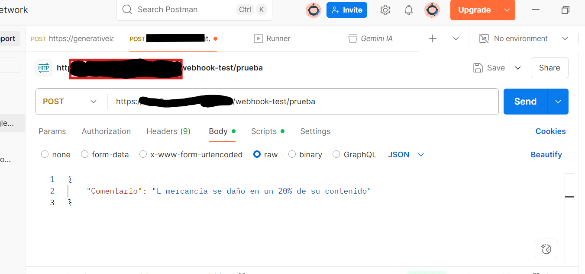
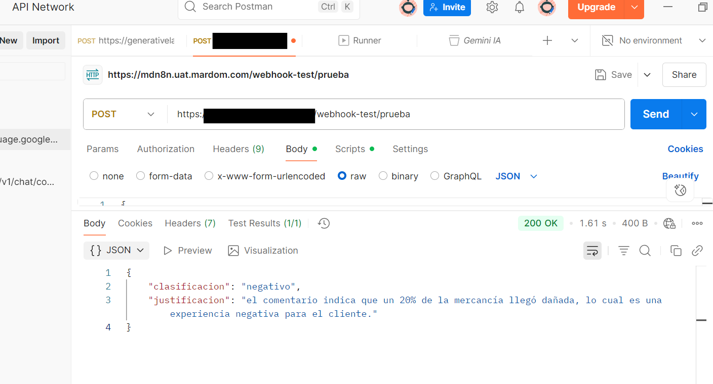
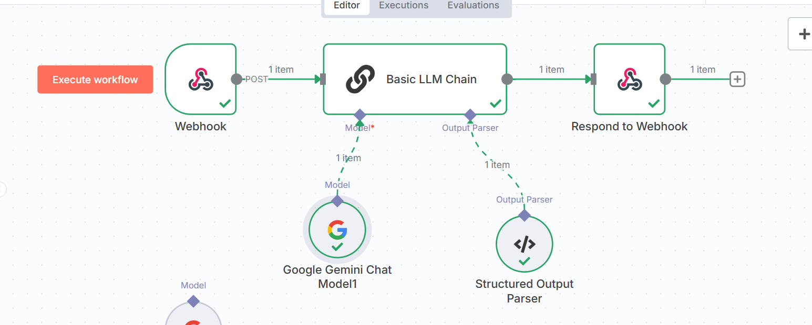

# 🤖 Webhook-based AI Chat with LLM

This project implements a basic conversational AI system using **n8n**, triggered by **webhooks**, and powered by **Google Gemini** via **LLM Chain** and structured output parser.

---

## 📌 Objective

To enable AI-powered natural language responses to incoming POST requests, with structured outputs ready to integrate into other systems or frontends.

---

## ⚙️ Tools Used

- **n8n** (Automation platform)
- **Webhook Trigger** (POST endpoint)
- **Google Gemini Chat Model**
- **LLM Chain Node**
- **Structured Output Parser**
- **Postman** (Request testing)

---

## 🚀 How It Works

1. A POST request is sent to a webhook (via Postman or another app).
2. The message is passed to the **LLM Chain node** with a prompt.
3. The response is parsed and returned with structured fields like:
   - answer
   - action_type
   - suggestion
4. The response can be reused or forwarded to other apps.

---

## 🧪 Example Request

```json
{
  "message": "The customer received the wrong item and wants a refund."
}
```

## 📤 Example Output

```json
{
  "answer": "I'm sorry to hear that. We will issue a refund and investigate.",
  "action_type": "refund",
  "suggestion": "Notify the support team and update the inventory system."
}
```

---

## 🖼️ Screenshots

| Webhook Trigger | LLM Chain Output | Workflow Webhook Chat llm |
|-----------------|------------------|------------------|
|  |  |

---

## 📂 Files

- `workflow-webhook-chat-llm.json`: Exported n8n flow for chatbot automation.
- `screenshots/`: Workflow visuals


---

## 👩‍💻 Created by

[Katherine Pereyra](https://github.com/kpereyra-sudo/katherinepereyra) – Data & AI Developer specializing in generative AI automation.
